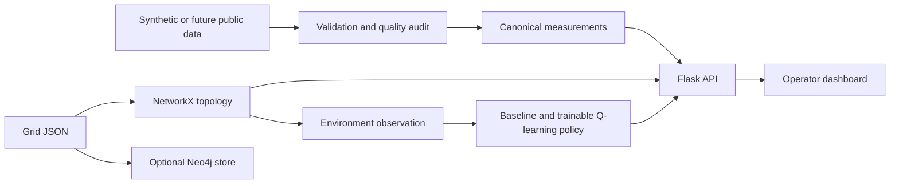

# PRISM: Power Grid Resilience through Intelligent Smart Management

PRISM is an academic decision-support prototype for studying resilient power-grid
operation under changing demand, renewable generation, and equipment faults. The
intended system combines time-series forecasting, constraint-aware dispatch,
Q-learning, explainable machine learning, and graph-based fault diagnosis in one
operator-facing workflow.

Phase 1 establishes the reproducible software and research foundation on which
those models will be evaluated. It provides validated data contracts, a synthetic
grid topology, a baseline dispatch interface, the proposed reinforcement-learning
state encoding, an API, a responsive dashboard, and optional Neo4j persistence.

> **Research status:** all bundled measurements and grid assets are synthetic.
> Phase 1 contains no live grid feed, trained forecasting model, trained Q-learning
> policy, SHAP explanation, dynamic fault simulation, power-flow solver, or
> operational switching capability. Values shown in the dashboard are development
> fixtures and must not be interpreted as results for the Delhi or Indian grid.

**Current Phase 2 checkpoint:** the repository now contains deterministic
15-minute simulator dynamics, constrained generator and battery actions, scheduled
asset outages, a trainable and persistent tabular Q-learning implementation, and
persistence/autoregressive forecasting baselines. The simulator remains an
aggregate teaching model without AC/DC power flow. No trained policy is enabled as
an application default, and LSTM, XGBoost/SHAP, real-time ingestion, and operational
control remain unimplemented.

## Research motivation

Increasing renewable penetration makes grid balancing more dependent on timely
forecasts, rapid diagnosis, and dispatch decisions that operators can understand.
PRISM investigates whether a digital-twin-style environment can connect these
functions while keeping the recommendation process observable and reproducible.

The project is guided by four questions:

1. How accurately can demand and renewable generation be forecast at a useful
   operational horizon?
2. Can a Q-learning policy improve simulated dispatch outcomes relative to a
   deterministic baseline while respecting shared feasibility constraints?
3. Can an explainable surrogate reproduce the learned policy closely enough to
   provide useful local explanations without misrepresenting the policy?
4. Can graph topology, observed events, and event timing identify likely fault
   origins quickly and consistently in controlled scenarios?

Phase 1 does not answer these questions. It defines the interfaces and evidence
needed to test them in subsequent phases.

## Phase 1 contributions

| Area | Implemented contribution |
|---|---|
| Data | Strict hourly schema, validation, rejection audit, gap reporting, reproducible 336-row synthetic fixture |
| Grid model | Validated 12-node, 12-edge teaching topology using NetworkX, plus optional idempotent Neo4j persistence |
| Dispatch and RL | Validated observation contract, six-action vocabulary, 270-state encoding, and non-executable aggregate baseline recommendation |
| Simulation | Isolated resettable environment skeleton; dynamics are deliberately unimplemented |
| Application | Flask API, OpenAPI document, responsive dashboard, asset inspection, filters, sample charts, and explicit planned-endpoint responses |
| Verification | 19 automated tests, JavaScript syntax check, live Neo4j import test, and desktop/mobile dashboard checks |

## System overview



The Phase 1 dashboard reads validated JSON and CSV fixtures. Neo4j is an optional
persistence target and is not required to run the dashboard.

## Documentation

The five primary, human-readable research documents are:

- [`README.md`](README.md): project entry point, status, setup, and navigation.
- [`DECISIONS.md`](DECISIONS.md): accepted technical and research decisions.
- [`docs/METHODOLOGY.md`](docs/METHODOLOGY.md): implemented Phase 1 methods and
  the boundaries of planned methods.
- [`docs/DATASET_AND_PREPROCESSING.md`](docs/DATASET_AND_PREPROCESSING.md): data
  provenance, schema, validation, and limitations.
- [`docs/EXPERIMENTAL_PROTOCOL.md`](docs/EXPERIMENTAL_PROTOCOL.md): Phase 1
  verification protocol and preregistered principles for later evaluation.

Supporting specifications remain in `docs/architecture.md`,
`docs/dispatch_rl_design.md`, `docs/openapi.json`, and `docs/verification.md`.
All phase-wise individual work is recorded in the single root-level
[`CONTRIBUTIONS.md`](CONTRIBUTIONS.md).

## Run locally

Requires Python 3.11+ (verified on Python 3.12). From the repository root:

```bash
python3 -m venv .venv
source .venv/bin/activate
python -m pip install -r requirements-tested.txt
python -m pip install -e .
python -m prism
```

Open http://127.0.0.1:5050 . Committed fixtures allow immediate startup. The Flask
server is a local development server. `PRISM_HOST` defaults to 127.0.0.1 and
`PRISM_PORT` to 5050. `.env.example` documents variables; export them in your shell
(the app does not automatically read .env).

## Reproduce sample data and run checks

```bash
python -m scripts.generate_sample
python -m scripts.prepare_data
python -m unittest discover -s tests -v
```

Run the first Phase 2 experiments without enabling them as production models:

```bash
python -m scripts.evaluate_forecasting
python -m scripts.train_q_learning --episodes 500
```

These commands write inspectable JSON artifacts below `artifacts/`. Generated
artifacts are ignored by Git by default and must be reviewed, identified, and
promoted deliberately before they are used by an application endpoint or cited in
a paper.

Generated data: `data/raw/grid.json`, `data/raw/synthetic_measurements.csv`.
Prepared data and audit: `data/processed/`. The 14-day sample supports pipeline
checks, not claims about seasonal forecasting accuracy. It is separate from the
static graph snapshot. See docs/data_dictionary.md for timestamps and rejection
rules, and docs/data_sources.md for real-data acquisition limitations.

## Optional Neo4j

The dashboard works without Neo4j. To verify the persistence adapter against a
local database, first install/start Docker, choose a local password and export it:

```bash
python -m pip install -e '.[neo4j]'
export NEO4J_PASSWORD='choose-a-local-password'
docker compose up -d neo4j
python -m scripts.seed_neo4j
```

Allow Neo4j to finish starting before seeding. Expected counts: 12 nodes, 12 edges.
Running the seed again replaces only the `prism_phase1` dataset; it does not append
copies. Browser UI: http://127.0.0.1:7474 . Query:

```cypher
MATCH (n:PrismNode {dataset: 'prism_phase1'}) RETURN n;
```

NetworkX/JSON validation is covered by automated checks. To run an isolated live
Neo4j import/idempotency test: `python -m scripts.verify_neo4j`. This downloads the
Community image, uses loopback port 17687, and removes its temporary container
afterward. A normal demo database is started separately using Compose above.

## API

| Route | Status |
|---|---|
| GET /api/health, /api/status | Application and module status |
| GET /api/grid | Validated grid with aggregate summary |
| GET /api/measurements?limit=24 | Latest sample rows; limit 1–336 |
| GET /api/data/quality | Preprocessing audit |
| GET or POST /api/dispatch/baseline | Non-executable baseline preview |
| GET /api/openapi.json | OpenAPI contract |
| GET /api/forecast?target=demand_mw&model=persistence&horizon=1 | Synthetic persistence or autoregressive forecast, horizon 1–24 |
| POST /api/scenario | Run 1–96 constrained synthetic simulation steps with optional actions and faults |
| POST /api/dispatch, /api/explain | 501 until a reviewed policy or explanation artifact is configured |

Example POST body for `/api/dispatch/baseline`:

```json
{"demand_mw": 900, "generation_mw": 700, "reserve_mw": 50}
```

The proposal is 50 MW increased generation with 150 MW residual gap and
`executable: false`. Feasibility describes aggregate reserve only; plant ramp,
minimum output, battery, and topology availability checks are applied only inside
the Phase 2 scenario simulator.

Example scenario request:

```json
{
  "steps": 4,
  "seed": 42,
  "faults": [{"step": 1, "asset_id": "gas", "duration_steps": 2}]
}
```

If `actions` is omitted, the scenario uses the rule-based prototype subject to the
simulator's action mask. Supplying `actions` requires one of the six documented
actions for every requested step.

## Project status and next phase

See `CONTRIBUTIONS.md` for the four members' phase-wise work and review
demonstrations. See `docs/architecture.md` for implementation boundaries,
`docs/dispatch_rl_design.md` for the detailed RL contract, and
`docs/dashboard.md` for interface behavior.

Phase 2 is in progress. Its simulation core, forecasting baselines, and tabular
Q-learning trainer are implemented. Remaining Phase 2 work includes an LSTM
comparison, multi-seed policy evaluation against the baseline, trained-policy API
activation, and dashboard simulation controls. Phase 3 integrates real-time
streaming, background simulation, XGBoost/SHAP and the full operator flow. Phase 4
evaluates all modules and assembles final evidence. No accuracy or latency target is
reported as achieved by the current checkpoint.

## Verification environment

The local `.venv` was created with access to existing system packages to reuse
available dependencies. Editable installation and all 37 tests passed there.
`requirements-tested.txt` records the core versions used; the commands above
create an isolated environment on a new machine. See docs/verification.md for
the final validation record. Restart the server after template changes when
running with debug mode disabled.
