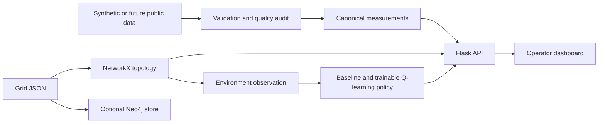

# PRISM: Power Grid Resilience through Intelligent Smart Management

[](https://www.python.org/)
[](https://flask.palletsprojects.com/)
[](https://numpy.org/)
[](https://pandas.pydata.org/)
[](https://networkx.org/)
[](https://neo4j.com/)
[](https://docs.docker.com/compose/)
[](https://developer.mozilla.org/en-US/docs/Web)

PRISM is an academic decision-support prototype for studying resilient power-grid
operation under changing demand, renewable generation, and equipment faults. The
intended system combines time-series forecasting, constraint-aware dispatch,
Q-learning, explainable machine learning, and graph-based fault diagnosis in one
operator-facing workflow.

Phase 2 completes the reproducible simulation-and-learning layer built on the
Phase 1 foundation. It provides an audited 90-day synthetic series, three forecast
methods including a compact LSTM, a constrained simulator, five versioned fault
scenarios, multi-seed Q-learning evidence, reviewed model artifacts, and an
interactive forecast and scenario dashboard.

> **Research status:** all bundled measurements and grid assets are synthetic.
> Phase 2 contains no live grid feed, SHAP explanation, power-flow solver, or
> operational switching capability. Its trained models and all displayed values
> use generated development data and must not be interpreted as results for the
> Delhi or Indian grid.

**Current status:** Phase 2 is complete. The reviewed Q-table is exposed only as a
selectable, non-executable recommendation policy. On held-out synthetic scenarios,
it did not improve overall reward over the rule baseline; the complete positive
and negative results remain in `reports/phase2_dispatch.json`. Real-time ingestion
and XGBoost/SHAP begin in Phase 3.

## Technology stack

| Technology | Role in PRISM |
|---|---|
| [Python](https://www.python.org/) | Application, simulation, forecasting, Q-learning, scripts, and tests |
| [Flask](https://flask.palletsprojects.com/) | Local web application and JSON API |
| [NumPy](https://numpy.org/) | Numerical operations, Q-table storage, metrics, and the compact LSTM |
| [pandas](https://pandas.pydata.org/) | Measurement validation, chronological datasets, and scenario profiles |
| [NetworkX](https://networkx.org/) | Topology validation, connectivity, and fault reachability |
| [Neo4j](https://neo4j.com/) | Optional graph persistence and import verification |
| [HTML, CSS, and JavaScript](https://developer.mozilla.org/en-US/docs/Web) | Responsive dashboard, charts, themes, and interactions |
| [Docker Compose](https://docs.docker.com/compose/) | Optional local Neo4j service |

## Research motivation

Increasing renewable penetration makes grid balancing more dependent on timely
forecasts, rapid diagnosis, and dispatch decisions that operators can understand.
PRISM investigates whether a digital-twin-style environment can connect these
functions while keeping the recommendation process observable and reproducible.

The project is guided by four questions:

1. How accurately can demand and renewable generation be forecast at a useful
   operational horizon?
2. Can a Q-learning policy improve simulated dispatch outcomes relative to a
   deterministic baseline while respecting shared feasibility constraints?
3. Can an explainable surrogate reproduce the learned policy closely enough to
   provide useful local explanations without misrepresenting the policy?
4. Can graph topology, observed events, and event timing identify likely fault
   origins quickly and consistently in controlled scenarios?

Phase 1 does not answer these questions. It defines the interfaces and evidence
needed to test them in subsequent phases.

## Phase 1 contributions

| Area | Implemented contribution |
|---|---|
| Data | Strict hourly schema, validation, rejection audit, gap reporting, reproducible 336-row synthetic fixture |
| Grid model | Validated 12-node, 12-edge teaching topology using NetworkX, plus optional idempotent Neo4j persistence |
| Dispatch and RL | Validated observation contract, six-action vocabulary, 270-state encoding, and non-executable aggregate baseline recommendation |
| Simulation | Isolated resettable environment skeleton; dynamics are deliberately unimplemented |
| Application | Flask API, OpenAPI document, responsive dashboard, asset inspection, filters, sample charts, and explicit planned-endpoint responses |
| Verification | 19 automated tests, JavaScript syntax check, live Neo4j import test, and desktop/mobile dashboard checks |

## Phase 2 contributions

| Area | Implemented contribution |
|---|---|
| Data and forecasting | 2,160-row audited synthetic fixture; persistence, autoregressive, and NumPy LSTM models; chronological comparison |
| Dispatch and RL | Five-seed tabular Q-learning evaluation, validation-selected JSON policy, non-executable recommendation API |
| Simulation | Constrained 15-minute transitions and a versioned five-scenario normal/ramp/fault suite |
| Application | Forecast and scenario APIs plus responsive labs, fault controls, charts, metrics, and event log |
| Evidence | Committed checksummed reports, reviewed artifacts, 42 automated tests, and desktop/mobile browser verification |

## System overview



The dashboard reads validated JSON/CSV fixtures and reviewed local model artifacts.
Neo4j is an optional persistence target and is not required to run the dashboard.

## Documentation

The five primary, human-readable research documents are:

- [`README.md`](README.md): project entry point, status, setup, and navigation.
- [`DECISIONS.md`](DECISIONS.md): accepted technical and research decisions.
- [`docs/METHODOLOGY.md`](docs/METHODOLOGY.md): implemented Phase 1–2 methods and
  their assurance boundaries.
- [`docs/DATASET_AND_PREPROCESSING.md`](docs/DATASET_AND_PREPROCESSING.md): data
  provenance, schema, validation, and limitations.
- [`docs/EXPERIMENTAL_PROTOCOL.md`](docs/EXPERIMENTAL_PROTOCOL.md): construction
  criteria, evaluation rules, and the Phase 2 result record.

Supporting specifications remain in `docs/architecture.md`,
`docs/dispatch_rl_design.md`, `docs/openapi.json`, and `docs/verification.md`.
All phase-wise individual work is recorded in the single root-level
[`CONTRIBUTIONS.md`](CONTRIBUTIONS.md).

For installation, platform-specific commands, verification, and troubleshooting,
see [`INSTRUCTIONS.md`](INSTRUCTIONS.md).

## Run locally

Requires Python 3.11+ (verified on Python 3.12). From the repository root:

```bash
python3 -m venv .venv
source .venv/bin/activate
python -m pip install -r requirements-tested.txt
python -m pip install -e .
python -m prism
```

Open http://127.0.0.1:5050 . Committed fixtures allow immediate startup. The Flask
server is a local development server. `PRISM_HOST` defaults to 127.0.0.1 and
`PRISM_PORT` to 5050. `.env.example` documents variables; export them in your shell
(the app does not automatically read .env).

## Reproduce sample data and run checks

```bash
python -m scripts.generate_sample
python -m scripts.prepare_data
python -m unittest discover -s tests -v
```

Reproduce the Phase 2 experiments and committed review artifacts:

```bash
python -m scripts.evaluate_forecasting
python -m scripts.evaluate_q_learning --episodes 500
```

These commands write inspectable reports in `reports/` and reviewed JSON models in
`models/`. The reports retain data/model checksums, chronological splits, five
independent Q-learning seeds, and paired held-out scenario metrics.

Generated data: `data/raw/grid.json`, `data/raw/synthetic_measurements.csv`.
Prepared data and audit: `data/processed/`. The 90-day generated sample supports
method comparison, not claims about real-grid or seasonal accuracy. It is separate from the
static graph snapshot. See docs/data_dictionary.md for timestamps and rejection
rules, and docs/data_sources.md for real-data acquisition limitations.

## Optional Neo4j

The dashboard works without Neo4j. To verify the persistence adapter against a
local database, first install/start Docker, choose a local password and export it:

```bash
python -m pip install -e '.[neo4j]'
export NEO4J_PASSWORD='choose-a-local-password'
docker compose up -d neo4j
python -m scripts.seed_neo4j
```

Allow Neo4j to finish starting before seeding. Expected counts: 12 nodes, 12 edges.
Running the seed again replaces only the `prism_phase1` dataset; it does not append
copies. Browser UI: http://127.0.0.1:7474 . Query:

```cypher
MATCH (n:PrismNode {dataset: 'prism_phase1'}) RETURN n;
```

NetworkX/JSON validation is covered by automated checks. To run an isolated live
Neo4j import/idempotency test: `python -m scripts.verify_neo4j`. This downloads the
Community image, uses loopback port 17687, and removes its temporary container
afterward. A normal demo database is started separately using Compose above.

## API

| Route | Status |
|---|---|
| GET /api/health, /api/status | Application and module status |
| GET /api/grid | Validated grid with aggregate summary |
| GET /api/measurements?limit=24 | Latest sample rows; limit 1–2160 |
| GET /api/data/quality | Preprocessing audit |
| GET or POST /api/dispatch/baseline | Non-executable baseline preview |
| GET /api/openapi.json | OpenAPI contract |
| GET /api/forecast?target=demand_mw&model=lstm&horizon=1 | Synthetic persistence, autoregressive, or LSTM forecast; horizon 1–24 |
| POST /api/scenario | Run 1–96 constrained synthetic steps with baseline/Q-learning policy, optional actions, and faults |
| POST /api/dispatch | Reviewed Q-learning recommendation; always `executable: false` |
| POST /api/explain | 501 until the Phase 3 explanation model is configured |

Example POST body for `/api/dispatch/baseline`:

```json
{"demand_mw": 900, "generation_mw": 700, "reserve_mw": 50}
```

The proposal is 50 MW increased generation with 150 MW residual gap and
`executable: false`. Feasibility describes aggregate reserve only; plant ramp,
minimum output, battery, and topology availability checks are applied only inside
the Phase 2 scenario simulator.

Example scenario request:

```json
{
  "steps": 4,
  "seed": 42,
  "faults": [{"step": 1, "asset_id": "gas", "duration_steps": 2}]
}
```

If `actions` is omitted, set `policy` to `baseline` or `q_learning`; both share the
simulator's action mask. Supplying `actions` requires one of the six documented
actions for every step and cannot be combined with `policy`.

## Project status and next phase

See `CONTRIBUTIONS.md` for the four members' phase-wise work and review
demonstrations. See `docs/architecture.md` for implementation boundaries,
`docs/dispatch_rl_design.md` for the detailed RL contract, and
`docs/dashboard.md` for interface behavior.

Phase 2 is complete: forecasting, simulation, Q-learning, comparative evidence,
reviewed artifacts, APIs, and dashboard workflows are implemented. Phase 3
integrates real-time streaming, background simulation, XGBoost/SHAP, and the full
operator flow. Phase 4 evaluates all modules and assembles final evidence. No
real-grid accuracy, superiority, or latency target is reported as achieved.

## Verification environment

The local `.venv` was created with access to existing system packages to reuse
available dependencies. Editable installation and all 42 tests passed there.
`requirements-tested.txt` records the core versions used; the commands above
create an isolated environment on a new machine. See docs/verification.md for
the final validation record. Restart the server after template changes when
running with debug mode disabled.
