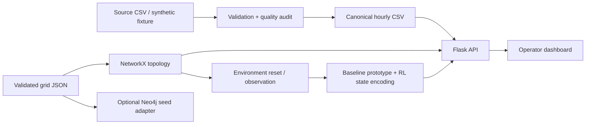
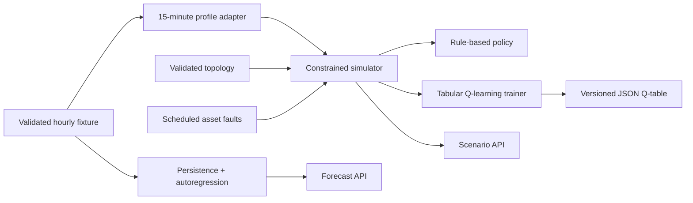

# Phase 1 architecture

## Ownership boundaries

- Nishtha owns measurement schema, source assessment and preprocessing.
- Himangi owns observation encoding, action/reward specification and baseline policy.
- Shrankhala owns graph validation, Neo4j adapter and environment lifecycle.
- Gaurangi owns HTTP contracts, frontend interactions and application integration.

`GridEnvironment.reset()` returns an independent snapshot. Phase 2 implements
`step(Action)` with the project-specific `(observation, reward, terminated, info)`
interface. Horizon completion is represented by `terminated`; this is not a claim
of Gymnasium compatibility. Runtime fault states may be disconnected and use
reachability checks instead of the stricter initial-topology validator.

## Graph schema

JSON nodes have unique `id`, `name`, `kind`, `status`, and display x/y coordinates.
Plants have fuel, capacity_mw, output_mw. Substations have voltage_kv. Loads have
demand_mw and priority. Edges have unique id, source, target, positive capacity_mw
and status. The validator rejects disconnected initial topology, duplicate IDs,
invalid endpoints, duplicate parallel edges, and invalid ratings. Phase 2 fault
states may be disconnected and will use a separate runtime validation policy.

NetworkX uses an undirected graph: stored source/target is not a fixed direction
of electrical flow. Neo4j stores `(:PrismNode {dataset,id,kind,...})-[:LINE]->(...)`.
The common label and `kind` property simplify import; kinds distinguish plant,
substation and load. The seed replaces only dataset `prism_phase1` transactionally
and creates a composite uniqueness constraint. Do not use this fixture dataset
namespace for real assets. The UI reads JSON in Phase 1; it does not claim Neo4j
is connected. External grid imports are represented as synthetic plant capacity.

## Constraints and decisions

Python >=3.11; Flask for the documented API; NetworkX for topology; pandas for
validation. Browser-native HTML/CSS/JS keeps the initial dashboard runnable
without a second build tool. React migration can be considered during Phase 2.
Neo4j is optional locally; Redis/Celery follow during integration. No GPU or paid
API is required for the synthetic demo. The repository must run from its root
using an editable install because fixtures/docs remain repository resources.

No AC/DC power flow, frequency dynamics, operational control, learned model,
causal proof, uptime guarantee, or claimed accuracy is implemented in Phase 1.
Aggregate balance does not prove absence of congestion. PageRank will rank
structural importance; diagnosis will additionally need observations and event
timing. Review-II/design-PDF targets conflict (e.g. MAPE 5% vs 7%); keep both as
unconfirmed targets until the team agrees one evaluation protocol. Performance
numbers from the PDFs are not application results.

## Phase 2 architecture increment

Training remains outside Flask request handling. The application may generate a
development forecast or run a bounded synthetic scenario, but it does not train or
silently select a learned policy. `/api/dispatch` remains unavailable until a
reviewed artifact, provenance, and evaluation record are configured.
